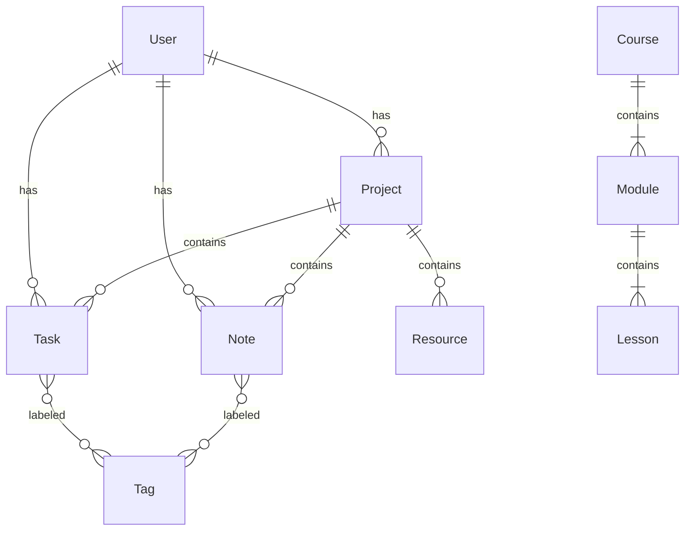

# Stage 3 — Veri Modeli + Postgres Şeması + İlişkilendirme

## Amaç
Esnek ama tutarlı bir veritabanı şeması oluşturmak. İlişkisel bütünlüğü korumak.

## 1. Entity Listesi (Core)
- `User`: Auth, Profile.
- `Workspace`: (Opsiyonel v2 - Multi-tenancy için). Biz MVP'de Single User odaklanalım ama `userId` ile ayıralım.
- `Task`: Görevler.
- `Note`: Notlar (Markdown/JSON).
- `Project`: Projeler.
- `Resource`: Kaynaklar (URL, File, Book).
- `Tag`: Etiketler (Çok'a çok ilişki).
- `Course`: Eğitim kursu.
- `Module`: Kurs modülü.
- `Lesson`: Ders.
- `Flashcard`: Bilgi kartı.
- `EntityRelation`: A entity ile B entity arasındaki jenerik bağ (Opsiyonel graph yapısı için).

## 2. Postgres Schema (Prisma)

### User
```prisma
model User {
  id        String   @id @default(uuid())
  email     String   @unique
  name      String?
  tasks     Task[]
  notes     Note[]
  projects  Project[]
  // ... other relations
}
```

### Task
```prisma
model Task {
  id          String    @id @default(uuid())
  title       String
  status      TaskStatus @default(INBOX) // INBOX, NEXT, WAITING, SOMEDAY, DONE, ARCHIVED
  priority    Priority   @default(MEDIUM) // LOW, MEDIUM, HIGH
  dueDate     DateTime?
  projectId   String?
  project     Project?   @relation(fields: [projectId], references: [id])
  tags        Tag[]
  userId      String
  user        User       @relation(fields: [userId], references: [id])
  createdAt   DateTime   @default(now())
}
```

### Note
```prisma
model Note {
  id          String   @id @default(uuid())
  title       String
  content     Json?    // TipTap JSON content
  isFavorite  Boolean  @default(false)
  tags        Tag[]
  projectId   String?
  project     Project? @relation(...)
  userId      String
  // Backlinks için ayrı bir join table veya array kullanılabilir
}
```

### Project
```prisma
model Project {
  id          String        @id @default(uuid())
  name        String
  status      ProjectStatus // IDEA, PLANNING, ACTIVE, COMPLETED, PAUSED, ARCHIVED
  tasks       Task[]
  notes       Note[]
  resources   Resource[]
  startDate   DateTime?
  endDate     DateTime?
}
```

## 3. İlişki Stratejisi
- **MVP:** Standart Foreign Key (`projectId` in Task).
- **Flexibility:** `Tag` sistemi Many-to-Many (`_TaskToTag`, `_NoteToTag`).
- **Graph:** Notlar arası bağlantı için `NoteLink` tablosu (SourceID, TargetID).

## 4. Search Stratejisi
- **Basit Arama:** `ILIKE %query%` (Title üzerinde).
- **Pro Arama:** Postgres `tsvector` (Full Text Search). English/Turkish dictionary.
    - Not içeriği (JSON) text'e çevrilip indekslenmeli.

## 5. RLS (Row Level Security)
Supabase kullanıldığı için RLS kritik.
- **Kural:** `auth.uid() == row.user_id`
- Tüm tablolarda `userId` kolonu zorunlu.
- Servis rolü (backend) bypass edebilir, ama client doğrudan sorgu atarsa RLS devrededir.

## 6. Migration Naming
Format: `YYYYMMDDHHMM_description`
Ör: `202401151200_create_tasks_table`

## 7. Mermaid ERD (Özet)


## VARSAYIMLAR
- Notlar zengin metin (Rich Text) olarak JSON formatında saklanacak.
- Arama performansı için JSON içeriğinin düz metin kopyası bir kolonda tutulabilir veya GIN index kullanılabilir.

## DOĞRULAMA YOLU
- `npx prisma db push` hatasız çalışmalı.
- SQL ile `User` silindiğinde ona bağlı `Task`ların da silinmesi (Cascade) veya korunması (SetNull) kararı test edilmeli (Genelde Cascade User silinince, SetNull Project silinince).
