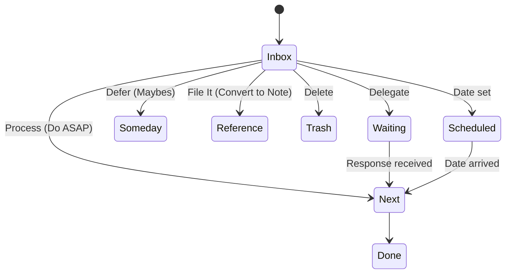

# Stage 4 — GTD Motoru: Inbox Processing + Tasks

## Amaç
Görev yönetimini, beynin çalışma şekline (Capture -> Organize -> Do) uygun hale getirmek.

## 1. Task State Machine

## 2. Recurring Tasks
- **MVP:** `recurrenceInterval` (DAILY, WEEKLY, MONTHLY). Task "Done" olduğunda yeni bir kopya oluşturulur.
- **V2:** Orjinal task "Parent" olur, instance'lar child olur. History takibi yapılır.

## 3. Inbox Processing UI
- "Focus Mode": Sadece tek bir Inbox öğesi gösterilir. 
- Altta aksiyon butonları: [Do (2min)] [Defer] [Delegate] [Delete].
- Klavye kısayolları ile hızlıca sıradakine geçilir.

## 4. Views
- **Today:** `dueDate <= today` OR `status == NEXT`.
- **Review:** `Weekly Review` için özel görünüm. Son 7 günde tamamlananlar + Bekleyenler.

---

# Stage 5 — Çok Güçlü Not Alanı

## Amaç
Düşünme aracı olarak not defteri.

## 1. Editor (TipTap)
- **Features:** Heading, Bold/Italic, List, Checklist, Code Block, Blockquote, Image.
- **Slash Commands:** `/` basınca menü açılır.

## 2. Linkleme
- **Wiki-links:** `[[` yazınca not başlıkları aranır. Seçilince link oluşturulur.
- **Backlinks:** Bir notun altında "Linked References" bölümü. Bu nota link veren diğer notları gösterir.

## 3. Templates
- **Katalog:** `/templates` klasöründe JSON/Markdown olarak saklanır.
- **Örnekler:**
    - *Daily Journal:* Sabah niyeti, akşam şükranı.
    - *Meeting Note:* Katılımcılar, Gündem, Aksiyonlar.
    - *Literature Note:* Kaynak, Özet, Alıntılar, Fikirler.

---

# Stage 6 — Proje Merkezi

## Amaç
Fikirleri bitmiş ürünlere dönüştüren fabrika.

## 1. Pipeline (Evreler)
1. **Idea:** Ham fikir.
2. **Validation:** Araştırma yapılıyor.
3. **Planning:** Tasklar çıkarılıyor.
4. **Active:** Geliştirme/Üretim.
5. **Review/Test:** Son kontroller.
6. **Done:** Bitti.

## 2. Dashboard
- **Kanban:** Proje içindeki tasklar (To do, Doing, Done).
- **Resources:** Projeye bağlı linkler, dosyalar.
- **Log:** Karar defter (Decision Log) - Neden A teknolojisini seçtik?

---

# Stage 7 — Eğitim Merkezi

## Amaç
Yapılandırılmış öğrenme.

## 1. Hiyerarşi
`Course` -> `Module` -> `Lesson` -> `Concept`.

## 2. Lesson Note
- Video izlerken tutulan not. 
- Video timestamp'ine link verebilmeli (Ör: [04:20] "Burada önemli açıklama").

## 3. Flashcard Flow
- Not alırken;
- "Bu bir tanım" diye seç -> "Create Flashcard".
- Front: "Polymorphism nedir?"
- Back: "..."
- Bağlam: O anki ders.

---

# Stage 9 — Entegrasyonlar

## 1. Web Clipper
- **Bookmarklet:** Tarayıcıya kurulan basit JS. Sayfa başlık/URL alır, Inbox'a atar.
- **V2 (Extension):** Sayfa içeriğini seçip highlight etme.

## 2. Import/Export
- **Export:** `/api/export` -> JSON (Tüm veritabanı).
- **Import:** Notion CSV import (Mapping gerektirir).

## 3. Takvim
- **iCal Feed:** `webcal://app.com/api/calendar/user-uuid`.
- Google Takvim'e "Abone" olunur. Read-only.

---

# Stage 10 — Ops & Security

## 1. Güvenlik
- **RLS:** Veritabanı seviyesinde izolasyon.
- **Backup:** Supabase point-in-time recovery (PITR).
- **Audit:** Kritik işlemler (Delete Project) loglanır.

## 2. Performans
- **Image Opt:** `next/image` kullanımı.
- **Virtualization:** Çok uzun listeler için `react-window`.
- **Debounce:** Inputlarda 300ms gecikme.

## 3. Living System
- **Auto-Archive:** 6 ay dokunulmayan Someday task -> Archive.
- **Broken Links:** Link rot'u kontrol eden cron job.
